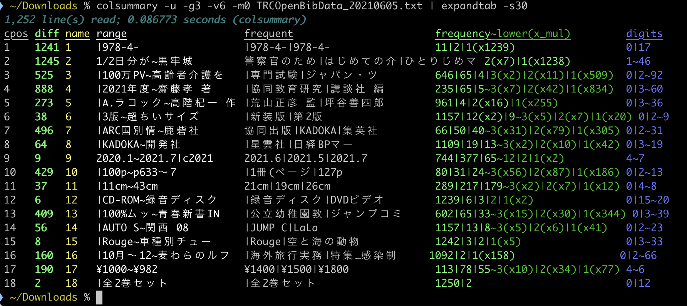

This module provides a Unix-like command `expandtab'.

Text::VisualWidth を利用して、
全角文字が混ざっていても、さらにはASCIIカラーコード付きの文字が混ざっていても、TSV形式(タブ区切り)のテキストデータに対して、各列が同じ位置に揃うように出力する。

例は次の画像の通りである。



▼
画像中のデータは[TRC新刊図書オープンデータ](https://www.trc.co.jp/trc_opendata/index.html)から取得したデータ「TRC新刊書誌情報 2021年06月05日（tsv形式）」である。元のページには次の様な記載がある(閲覧日/引用日は 2021年6月11日)。

```日本国内で刊行された新刊流通図書の書誌情報をオープンデータとして公開いたします。
※収録項目…ISBN，タイトル，サブタイトル，著者（2人まで），版表示，出版社，発売者，出版年月，ページ数等，大きさ，付属資料の種類と形態，シリーズ名・シリーズ番号（３つまで），各巻のタイトル，本体価格，セット本体価格
※毎週土曜日に、TRCで作成した1週間分の新刊書誌情報を掲載いたします。掲載期間は4週間です。なお、年末年始等の休業期間中には、更新はありません。
※この書誌情報は作成時点のものであり、その後変更される場合があります。
※この書誌情報は、営利・非営利を問わず、利用手続きなしでご自由にご利用いただけます。なお、この書誌情報を利用して行う行為について、弊社では一切責任を負うものではありません。
```
▼ 提供するソフトウェアについてのライセンス表示

 Copyright (c) 2021-2022 Toshiyuki SHIMONO. All rights reserved.
 This program is free software; you can redistribute it and/or
 modify it under the same terms as Perl itself.
